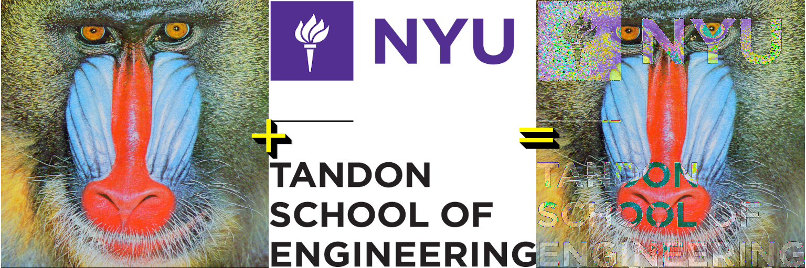
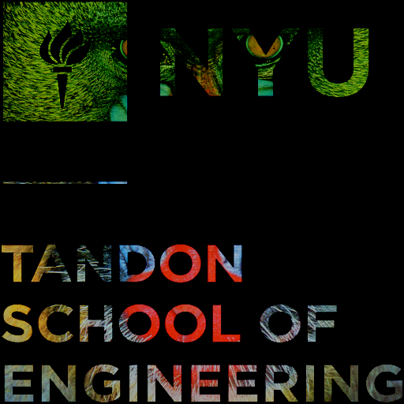
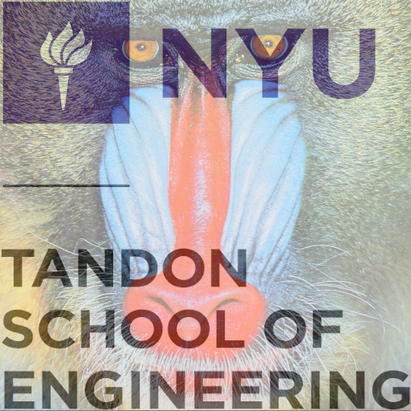
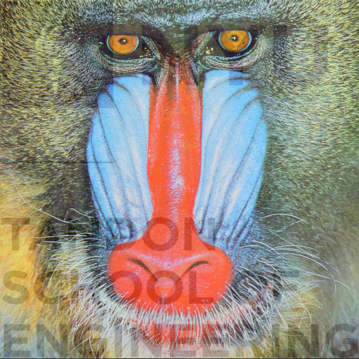

# CS-GY 6533 A – Interactive Computer Graphics - Fall 2021

# Assignment 1: Images

Handout date: 09/10/2021

Submission deadline: 09/17/2021, 11:59PM EST

Demo date: TBA, via Zoom appointments

This assignment accounts for 15\% of your final grade. 

## Goals

This assignment aims to get you familiar with C++ and some of the concepts and representation of images in digital form. As part of your work, you will implement a general image class in C++ and apply mathematical operations on  pictures from storage.

## Portable PixMap (PPM), Portable GreyMap (PGM), Portable BitMap (PBM) File Formats

The image file format you will work with is the Portable PixMap PPM (also known as PGM or PBM) file format. For more information about the file format, see:

* http://paulbourke.net/dataformats/ppm

* https://people.cs.clemson.edu/~dhouse/courses/405/notes/ppm-files.pdf

In this assignment, you must implement methods to handle PPM files of types: 

* P2 and P5: grayscale images in binary and ASCII representation, respectively

* P3 and P6: color images (R, G, B) in binary and ASCII representation, respectively. 

## Submission

* Follow the link (to be sent by email) to create your repository at https://classroom.github.com/a/ANXEZNyJ

* Add a README.md in markdown format as a report of what you did containing a screenshot for each task

* Push the code into the repository before deadline and make sure your code builds on Linux OS.

## Tasks

We advise all non-private questions be posted on the class Discord channel, as reference for all students.
For other questions, please email us or join us on the office hours.

## Mandatory Tasks

For each tasks below, add at least one image in the readme demonstrating the results. Although we provided test images (Mandrill and Tandon), you are encouraged to execute the following items on other images.

The code that you used for all tasks should be provided.

## Image Class

Implement a general image class in C++. Your class must handle PPM files of different types (P2, P3, P5, and P6) and load from and store the picture data on external storage.

You must create a performance-optimized and memory friendly representation for the internal data (the pixels data) 

Hint: Learn about contiguous memory allocation.

Here is an example of how the objects of your class should behave:

```cpp
#include <iostream>
#include <exception>

#include "MyImageClass.h"

int main(int argc, char* argv[]) {

    try {
        MyImageClass image1("path_to_image_on_disk/pic.ppm");
        
        // Another possible way to load it from the disk in the "C++ way"
        MyImageClass image2;
        ifstream imageFile1;
        // If the file is a PPM type 5 or 6 (binary)
        imageFile1.open("path_to_image_on_disk/pic.ppm", ios::in | ios::binary);
        if (imageFile1.is_open()) {
           imageFile1 >> image2;
           imageFile1.close();
        }

        // You can do this way
        image1.save("path_to_disk/changed_pic.ppm");

        //You also can do it in the "C++ way"
        ofstream imageFile;
        imageFile.open("path_to_disk/changed_pic.ppm");
        if (imageFile.is_open()) {
           imageFile << image1;
           imageFile.close();
        }
    } catch(exception& e) {
        std::cout << "Error: " << e.what() << std::endl;
    }

    return 0;
}
```

A good introduction to C++'s exceptions can be found here: http://www.cplusplus.com/doc/tutorial/exceptions/.

When projecting your image class remember, you must be able to create empty images or delete (reset) the content of an image.

## Operations on Images

Using https://en.cppreference.com/w/cpp/language/operators C++'s operator overloading mechanism, add the following operations to your image class:

* addition (also addition assignment), subtraction (also subtraction assignment), and multiplication by a scalar value,
* array index operator (brackets operator).  

Here is an example of how the objects of your class should behavior:

```cpp
#include <iostream>
#include <exception>

#include "MyImageClass.h"

int main(int argc, char* argv[]) {

    try {
        MyImageClass image1("path_to_image_on_disk/pic.ppm");
        MyImageClass image2("path_to_image_on_disk/pic2.ppm");
        MyImageClass image3;

        // Add Image 1 and 2 and assign result to image 3
        image3 = image1 + image2;

        image3.save("path_to_disk/add_pic.ppm");

        // Addition assignment plus mirroring on X axis
        MyImageClass image4;
        image4 += image3;
        image4.mirrorX();

        image4.save("path_to_disk/mirror_pic.ppm");

    } catch(exception& e) {
        std::cout << "Error: " << e.what() << std::endl;
    }

    return 0;
}
```



The result of adding the Mandrill image and the Tandon Color image together. What is happening with the colors in the resulting image?




The result of subtracting from the Mandrill image, the Tandon Color image.

You must pay attention to the following issues:

* The addition of images can generate results greater than the maximum value of a pixel (in a PPM file, the maximum value is equal to 255). You must allow this behavior for the \texttt{add} operator 
(operator+). However, when using the addition assignment operator (operator+=), you must average the result of adding the two pixels values.

* The subtracting operator can produce pixels with values less than zero (0). You must take care of this issue (hint: \texttt{std::clamp}).

* The multiplication of pixels by a scalar can produce overflows and underflows of pixels values.

## Gamma Correction

Utilizing the previously implemented operators, implement a method to apply gamma correction given a gamma constant value.

## Alpha Compositing

Alpha Compositing is explained in section 3.4 of the textbook. Utilizing the previously implemented operators and equation 3.2 in section 3.4, implement alpha compositing.



The result of applying alpha compositing to the Mandrill image (front picture) and the Tandon Color image (back picture) for an alpha value equals to 0.5.



The result of applying alpha compositing to the Mandrill image (front picture) and the Tandon Color image (back picture) for an alpha value equals to 0.85.

## Optional Tasks

This task is optional and worth 1.5% of the final grade. 

## Morphological Operators

Read about Morphological Operators on Images:

*  https://www.cs.auckland.ac.nz/courses/compsci773s1c/lectures/ImageProcessing-html/topic4.htm

*  https://www.di.univr.it/documenti/OccorrenzaIns/matdid/matdid699113.pdf

*  https://www.researchgate.net/publication/272484795_Morphological_Operations_for_Image_Processing_Understanding_and_its_Applications

And implement the dilatation and erosion operations. Given an image, e.g. Mandrill.ppm, apply the dilatation operation on it and save the result. Using the same original image, apply the erosion operation. Next, you must subtract from the result of the first operation (dilatation) the result of the second operation (erosion). What is the final result? Show it with pictures.
