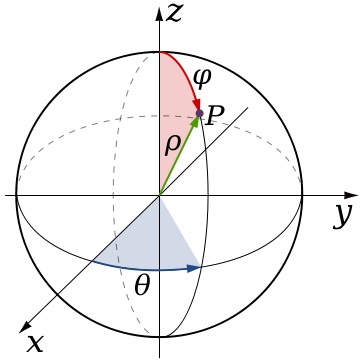

# CS-GY 6533 A – Interactive Computer Graphics - Fall 2021

# Assignment 2: 3: 3D Scene Editor

Handout date: 10/21/2021

Submission deadline: 11/04/2021, 11:59PM EST

Demo date: TBA, via Zoom appointments

This assignment accounts for 20% of your final grade. 

## Goals

In this exercise you will implement a 3D editor that allows to prepare 3D scenes composed of multiple 3D objects.

## GLM

In all exercises you will need to do operations with vectors and matrices. To simplify the code, you will use GLM:

* https://glm.g-truc.net/0.9.9/index.html

Have a look at the Getting Started page of GLM as well as the Code Samples page to acquaintain yourselves with the basic vector and matrix operations supported:

* https://github.com/g-truc/glm/blob/master/manual.md#section1

* https://github.com/g-truc/glm/blob/master/manual.md#section8

## OpenGL

In all exercises you will use OpenGL 3.3 with GLSL version 150 (You can use a newer version if you want).

## Submission

Try to maintain the same directory organization as the starter code, so you don't need to change the CMakeLists.txt file.

* Follow this to accept assignment and create repository: 

```bash
https://classroom.github.com/a/6WKxDqa3
```

* You MUST use the source code provided for Assignment 2 in the class repository. Don't forget to initialize and update the submodules: 

```bash
git submodule update --init --recursive https://github.com/nyu-cs-gy-6533-fall-2020/base 
```

* Modify the provided code following the assignment instructions.

* Add a report in markdown format that contains what you did with a screenshot for each task.

* Commit and push the code into the repository before the deadline.

## Mandatory Tasks

For each task below, add at least one image in the readme demonstrating the results. The code that you used for all tasks should be provided.

## Scene Editor

Implement an interactive application that allows to add, edit, and delete 3D meshes. The scene should always contain at least one light source. New objects can be added to the scene in three ways:

* The key '1' will add a unit cube in the origin

* The key '2' will import a new copy of the mesh 'bumpy_cube.off', scale it to fit into a unit cube and center it on the origin

* The key '3' will import a new copy the mesh 'bunny.off', scale it to fit into a unit cube and center it on the origin

Note that you can have multiple copies of the same object in the scene, and each copy can have its own position, scale, and rotation.

For this exercise, all transformations MUST be done in the shader. The VBO containing the vertex positions of each object should be uploaded only once to the GPU. 

## Object Control

Clicking on a object will select the object, changing its color. When an object is selected, it should be possible to translate it, rotate it around its barycenter, and rescale it without changing its barycenter. All these actions should be associated to keyboard keys (and the choice of keys should be detailed in the readme).

Each object also has a rendering setting associated with it, which can be one of the following three options:

* Wireframe: only the edges of the triangles are drawn

* Flat Shading: each triangle is rendered using a unique color (i.e. the normal of all the fragments that compose a triangle is simply the normal of the plane that contains it). On top of the flat shaded triangle, you should draw the wireframe.

* Phong Shading: the normals are specified on the vertices of the mesh and interpolated in the interior. The lighting equation should be evaluated for each fragment.


   
To compute the per-vertex normals you should first compute the per-face normals, and then average them on the neighboring vertices. In other words, the normal of the vertex of a mesh should be the average of the normals of the faces touching it. Remember to normalize the normals after averaging.

When an object is selected, it must be possible to switch between the different rendering modes by pressing three keys on the keyboard.

## Camera Control

Add the possibility to translate the position of the camera (similarly to the previous assignment), but in this exercise the camera should always *point to the origin*. It should be possible to move it around, but the camera should always face the origin.

Implement both a *orthographic camera* (similar to the one that you used for Assignment 2, but in 3D) and a *perspective camera*. The cameras should take into account the size of the window, properly adapting the aspect ratio to not distort the image whenever the window is resized. All functionalities should work after resizing the window, including object selection and editing of the scene.

## Optional Tasks

These tasks are optional. Each task worth 4% of the final grade.

## Blobby Man

In order to complete this extra task you must first read James Blinn's paper: 

* Nested Transformations and Blobby Man https://ieeexplore.ieee.org/stamp/stamp.jsp?arnumber=4057037

You must model (using spheres and ellipsis) and animate the Blobby Man in this extra task.

You must be able to select different parts of the Blobby Man's body (using keys or mouse selection) and animate them properly (the hands should move if the arm moved and so on). The video below shows Blinn's original animation and can (you don't need to reproduce all the animation) be used as an inspirational tool.

* https://www.youtube.com/watch?v=RjxkdEvuQUE&feature=emb_title

## Trackball

Use a trackball to control the camera. This can be achieved restricting the movement of the camera on a sphere centered on the origin. The easiest way to do it is to parametrize the sphere using spherical coordinates, and to assign keyboard keys to move the camera on the sphere. The camera should always look at the origin.



Ken Joy's lecture on Quartenions is useful to understand the trackbal. The whole video is on the topic, but at the 30 min mark, Prof. Joy discusses implementing a trackball.

* https://www.youtube.com/watch?v=mHVwd8gYLnI